# Buzzi — Line-Following Buzz Car

An educational line-following robot for kids aged 8–10, built by Team Buzzi for **ECE 3011 (ECE Design Fundamentals), Georgia Tech, Spring 2026**.
Buzzi follows a black line with two IR sensors and shows what it is "feeling" through two OLED eyes, a NeoPixel strip and sound, so students can see sensing and feedback control happen in real time. The bill of materials targets about $70 per unit, under a $100 budget.

<p align="center">
  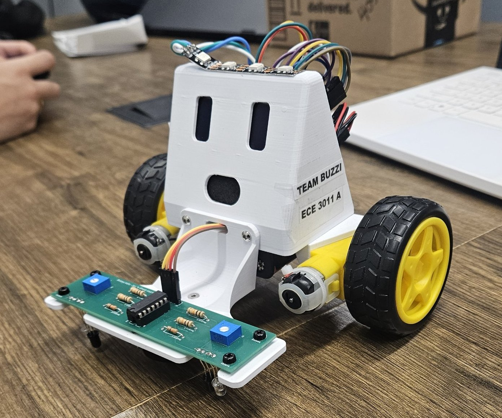
  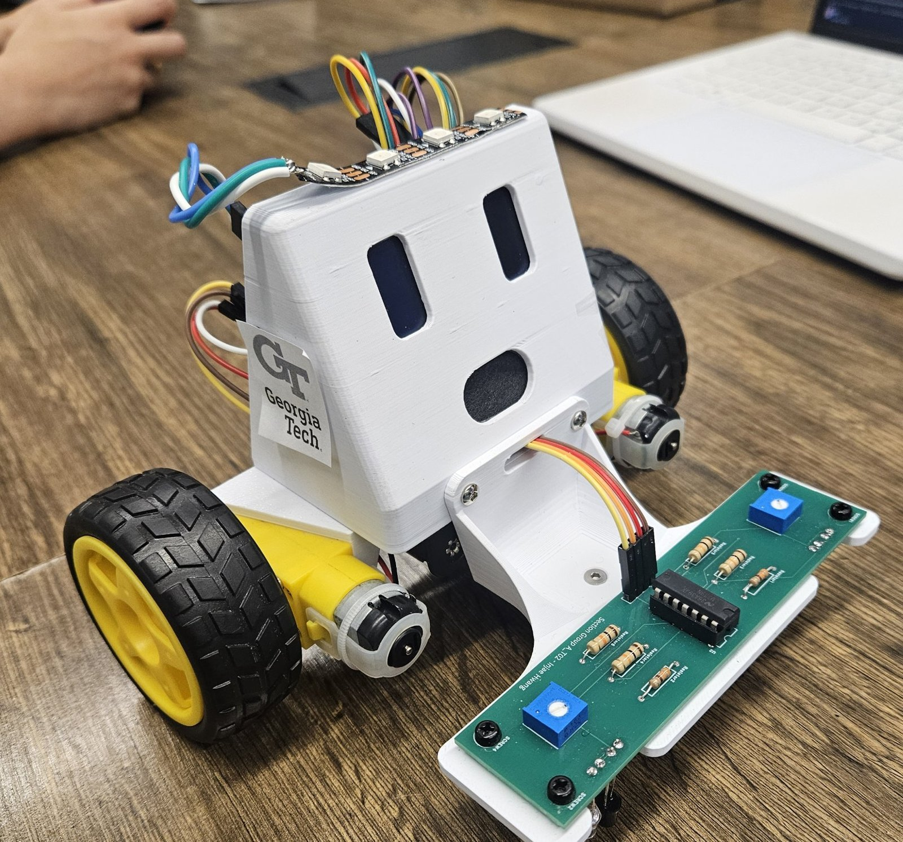
</p>

## System overview

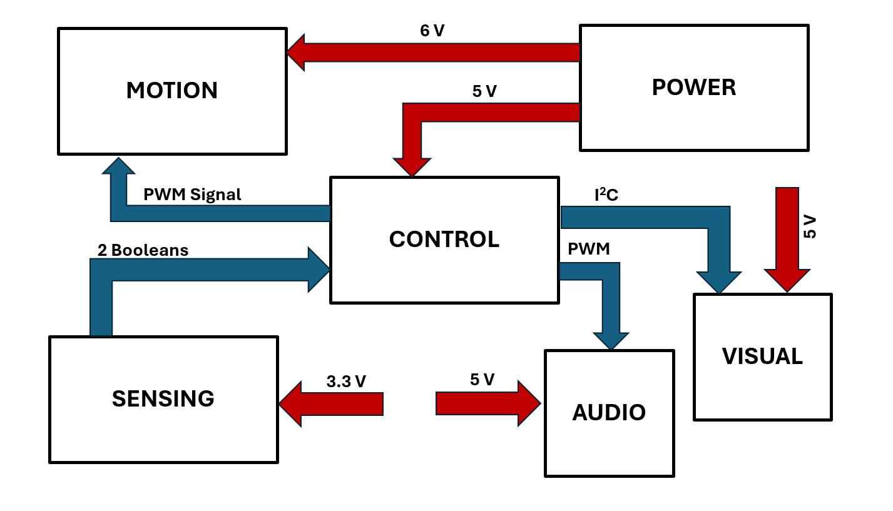

| Subsystem | Hardware |
|---|---|
| Control | ESP32-C6-DevKitC-1 |
| Sensing | Two IR LED and phototransistor pairs with an LM339 comparator on a custom sensor board |
| Motion | DRV8833 dual H-bridge, two TT brushed gearmotors, 65 mm wheels |
| Visual | Two 128×64 SSD1306 OLED "eyes" (I²C 0x3C / 0x3D), NeoPixel LED strip |
| Audio | PAM8904 amplifier driving an 8 Ω 1 W speaker from a PWM tone |
| Power | 6 V pack (4 × AA), MPM3610 5 V buck module, 3.3 V rail for the sensor board |

## Measured performance

| Item | Requirement | Measured |
|---|---|---|
| 3.3 V rail | 3.14–3.47 V | 3.31 V |
| 5 V rail | 4.75–5.25 V | 5.08 V |
| Gearmotor output speed at 6 V | ≥ 180 RPM | 210 RPM |
| Speaker loudness | Audible in a classroom | ~82 dB at 1 m |
| Sensor output | Clean digital logic | 0 V over white, 3.3 V over the line |

## Power

The 6 V battery pack drives the DRV8833 motor supply directly. An MPM3610 5 V buck module on the main PCB supplies the ESP32 DevKit, the NeoPixel strip and the audio amplifier. The sensor board is powered from 3.3 V rather than the 5 V pin on the J11 header, so its comparator outputs swing between 0 and 3.3 V and are safe for the ESP32 GPIO.

## Main PCB

<p align="center">
  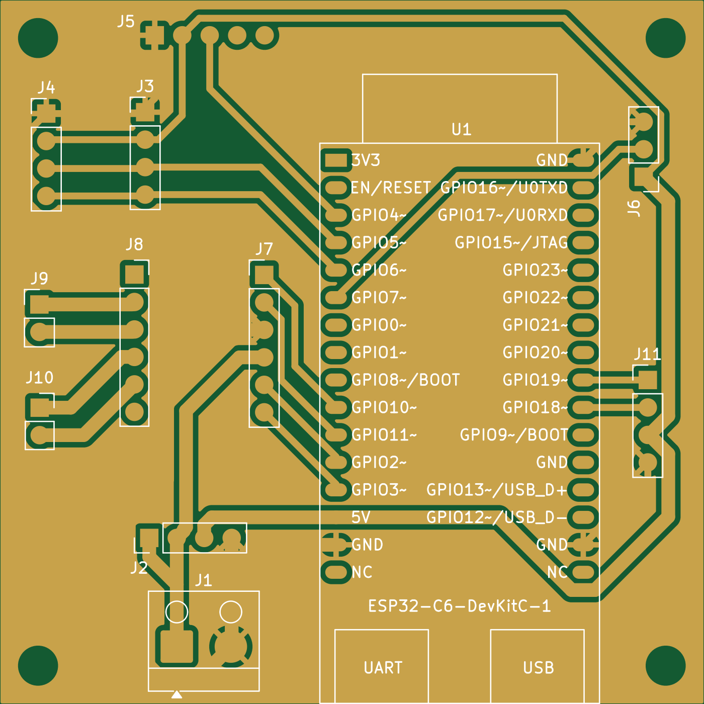
  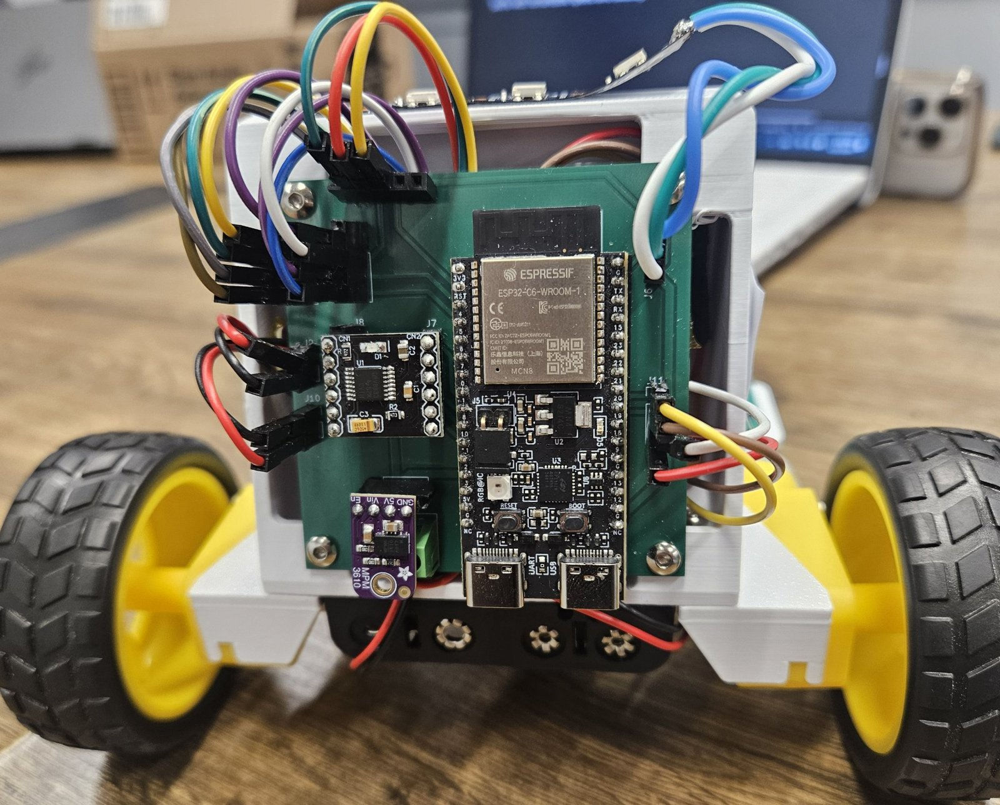
</p>

- 2-layer board, 65 × 65 mm, designed in KiCad 9
- Signal routing on the top layer, solid ground pour on the bottom layer
- Plug-in headers for every module, so each subsystem can be swapped or tested on its own
- Four M3 mounting holes; `gerbers.zip` is ready to upload to a PCB fab

| ESP32-C6 pin | Net | Connects to |
|---|---|---|
| GPIO2 / GPIO3 | M1F / M1R | DRV8833, motor 1 |
| GPIO10 / GPIO11 | M2F / M2R | DRV8833, motor 2 |
| GPIO18 | LeftSensor | Sensor header (J11) |
| GPIO19 | RightSensor | Sensor header (J11) |
| GPIO5 | SCL | Left / right OLED (J4, J3) |
| GPIO6 | SDA | Left / right OLED (J4, J3) |
| GPIO7 | LED | NeoPixel (J6) |
| GPIO4 | AMP | Audio amplifier (J5) |

## Sensor board

The sensor board was designed in EasyEDA Pro by Injae Hwang and passed DRC and ERC with zero errors.

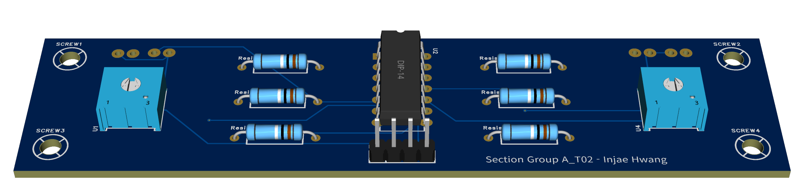

<p align="center">
  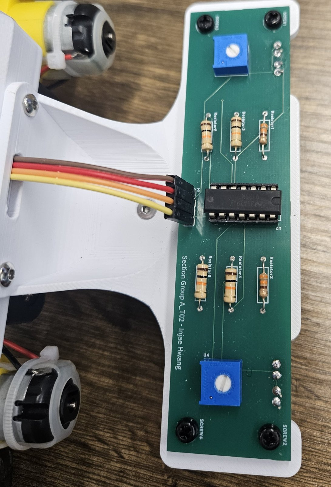
  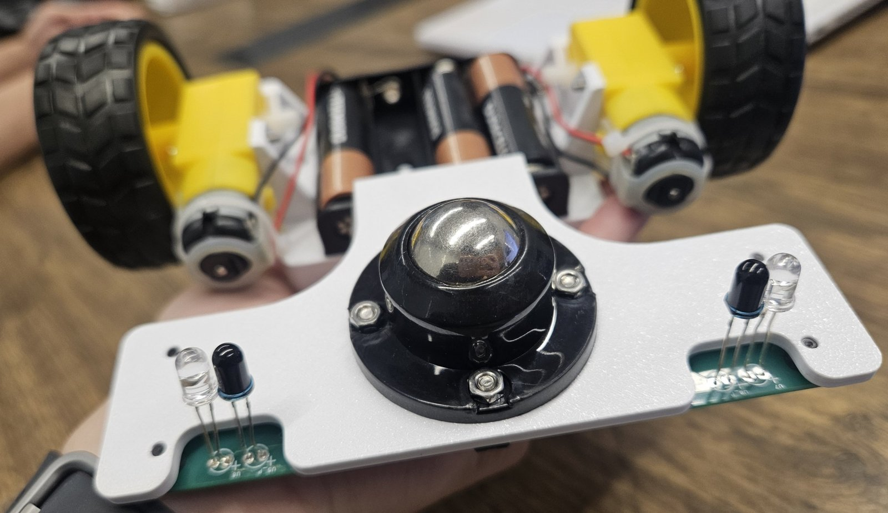
</p>

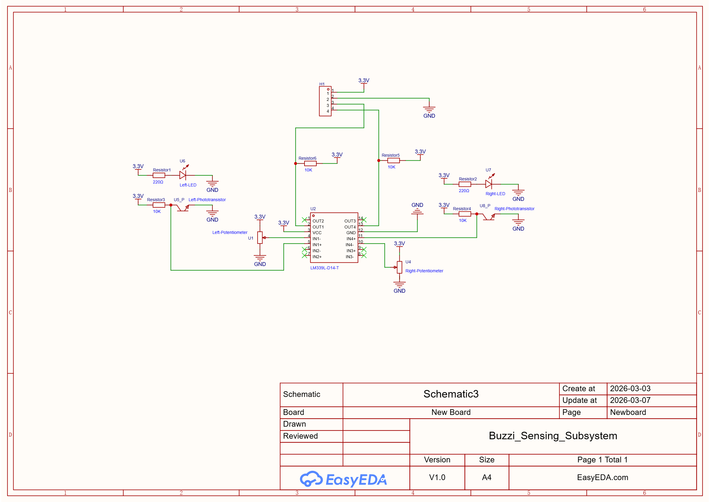

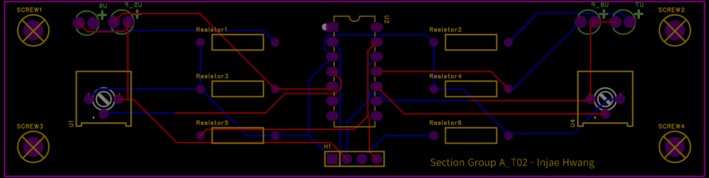

Each side of the car has an IR LED (220 Ω current limit) and a phototransistor with a 10 kΩ collector resistor, both facing the track. The phototransistor node drives the non-inverting input of one LM339 comparator channel, and a 10 kΩ potentiometer sets the threshold on the inverting input. Over a white surface the phototransistor conducts, the node falls below the threshold and the comparator output goes low. Over the black line the node rises and the output is pulled high by a 10 kΩ pull-up. The ESP32 therefore reads a clean digital HIGH when the sensor is on the line, and each side can be tuned separately for classroom lighting.

The emitters and detectors are mounted through the chassis plate so they face the track, with a ball caster between the two sensor pairs.

A two-sensor digital design was chosen over an eight-sensor analog array: it uses only two GPIO pins and almost no CPU time, which keeps the control loop at 100 Hz or faster.

| H1 pin | Signal |
|---|---|
| 1 | 3.3 V supply |
| 2 | GND |
| 3 | Left output (LM339 OUT1) |
| 4 | Right output (LM339 OUT4) |

Bench bring-up of the sensor prototype found three assembly faults:

1. **Phototransistors inserted with reversed polarity.** After fixing them, the raw analog reading separated clearly: about 160–190 on white and 2800–2900 on black (12-bit ADC counts).
2. **Missing 10 kΩ pull-up resistors on the LM339 outputs.** The LM339 has open-collector outputs, so without pull-ups the digital signal never went high.
3. **Emitter and detector mounted sideways instead of facing the surface.**

All three were assembly errors; the schematic itself was correct. With them fixed, the comparator thresholds were tuned with the potentiometers, and the turn logic was tuned until the car completed the course without leaving the track.

## Mechanical design

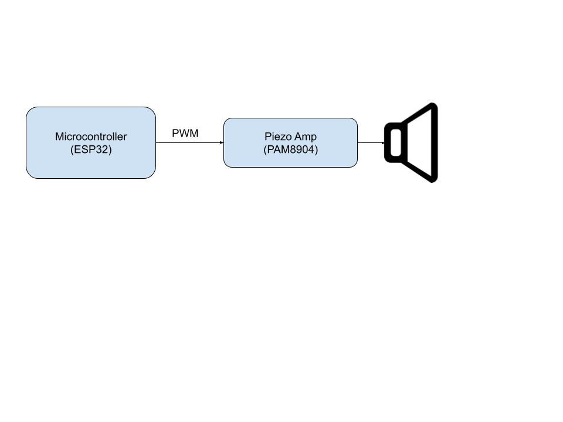

The 3D-printed body holds the two OLED eyes and the speaker in the face, the NeoPixel strip along the top edge, the main PCB on the back, and the battery pack between the two TT gearmotors.

## Repository layout

```
project_pcba/   KiCad project for the main PCB (schematic, layout, project file)
gerbers/        Main PCB Gerber and drill files
gerbers.zip     Same files, zipped for fab upload
docs/           Images
```

## Firmware

<!-- TODO: add the Arduino sketch to firmware/ and delete this comment -->

Built with the Arduino IDE for the ESP32-C6. Library dependencies: Adafruit GFX, Adafruit SSD1306, Adafruit NeoPixel.

## Team

Team Buzzi, ECE 3011 Section A_T02, Spring 2026. Instructor: Dr. Timothy Brothers.

| Member | Role |
|---|---|
| Injae Hwang | Sensing subsystem lead: sensor board design, LM339 comparator analysis, sensor test plan |
| Kevin Niu | Motion subsystem lead: mechanical design and TT motor integration |
| Jolson Zheng | Audio and visual subsystem lead: OLED eyes, NeoPixels and speaker |
| Tejaswi Manoj | Power and control subsystem lead: power distribution and ESP32 control logic |
